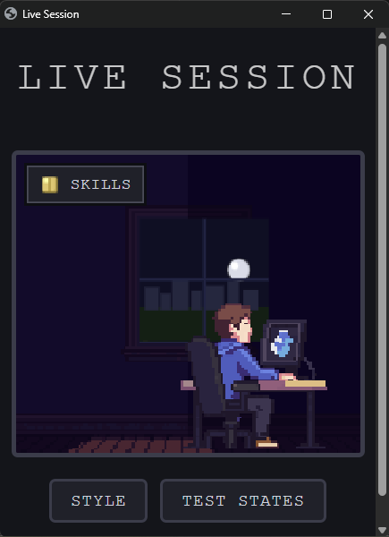

[🇬🇧 English](README.md) · 🇪🇸 **Español**

# Live Session

<p align="center"></p>

## 📑 Contenido

- [¿Qué es?](#que-es)
- [¿Qué puedo hacer con esto?](#que-puedo-hacer)
- [Estado](#estado)
- [¿Cómo lo pruebo?](#como-lo-pruebo)
- [Cómo está construido](#como-esta-construido)
  - [Stack tecnológico](#stack-tecnologico)
  - [Arquitectura](#arquitectura)
- [Cómo trabajo](#como-trabajo)
- [Documentación](#documentacion)
- [Autora](#autora)

<a id="que-es"></a>
## 🧩 ¿Qué es?

**Live Session** es una app local que acompaña a [Claude Code](https://claude.com/claude-code): un avatar en pixel art estilo 16 bits que se sienta junto a tu terminal y reacciona en vivo a lo que hace tu sesión de CLI — inactivo, trabajando, o con un error — más un navegador de solo lectura para tus skills instaladas de Claude Code. Es un proyecto personal en solitario, hecho para ganar experiencia real con desarrollo asistido por IA, no un producto; el código, el proceso y las retros de abajo son precisamente el punto.

<a id="que-puedo-hacer"></a>
## ✨ ¿Qué puedo hacer con esto?

- Ver al avatar reaccionar en tiempo real a los hooks de Claude Code (`SessionStart`, `PreToolUse`, `PostToolUse`, errores, `Stop`) por WebSocket — sin polling.
- Elegir entre temas de personaje terminados a mano (Developer, Chef) generados con [PixelLab](https://www.pixellab.ai/), cada uno con su propio detalle animado de fondo (un ciclo día/noche procedural en la ventana; una cocina que se enciende en el estado de error).
- Explorar cada skill de Claude instalada a nivel personal y de proyecto, leer su contenido completo, y copiar `/skill-name` al portapapeles para invocarla — sin salir del avatar.
- Ejecutarlo como una pestaña normal del navegador, o como una ventana flotante independiente (`npm run start:floating`) que se comporta como un widget de escritorio real.
- Conectar y desconectar todo el sistema desde cualquier proyecto de Claude Code con un solo comando cada uno (`npm run setup` / `npm run teardown`).

<a id="estado"></a>
## 📊 Estado

| | |
|---|---|
| **Build** |  — todavía sin pipeline de CI, los tests corren en local |
| **Calidad** |  — `node:test`, sin herramienta de cobertura configurada aún |
| **Paquetes** |     |
| **Scripts de arte (Python)** |   — sin `requirements.txt` todavía, versiones tomadas del virtualenv local |
| **Licencia** |  |

*Los badges son una foto fija con fecha (2026-09-28), no en vivo — el repositorio de GitHub es privado por ahora, así que los badges dinámicos de GitHub no pueden acceder a él. Pasarán a ser badges en vivo cuando el repositorio sea público.*

| Fase | Estado |
|---|---|
| v1 — avatar en vivo + navegador de skills ([Epic #1](https://github.com/ManonChab/8bit/issues/1)) | ✅ Hecho |
| Diseño visual y dirección de arte ([Epic #4](https://github.com/ManonChab/8bit/issues/4)) | 🚧 En progreso — 2 de 5 temas de fondo planeados ya publicados |

<a id="como-lo-pruebo"></a>
## 🚀 ¿Cómo lo pruebo?

**Requisitos:** Node.js (desarrollado con v24; todavía sin campo `engines` fijado) y un proyecto de [Claude Code](https://claude.com/claude-code) existente al cual conectarlo.

```bash
git clone https://github.com/ManonChab/8bit.git
cd 8bit
npm install
npm run setup            # conecta los hooks en ./.claude/settings.json del directorio actual
npm start                 # abre en una pestaña del navegador — o:
npm run start:floating    # abre como ventana flotante independiente
```

Ejecuta `npm test` para los tests unitarios, y `npm run teardown` para quitar los hooks de nuevo. Regenerar el arte (`scripts/pixellab/`) necesita tu propia `PIXELLAB_API_KEY` en un `.env` local — no hace falta solo para ejecutar la app.

<a id="como-esta-construido"></a>
## 🏗️ Cómo está construido

<a id="stack-tecnologico"></a>
### Stack tecnológico


Node.js + Express + `ws` sirven el avatar y reciben los hooks de Claude Code; el frontend es HTML/CSS/canvas JavaScript plano, sin paso de build. Python (`requests` + `python-dotenv`) impulsa los scripts puntuales en `scripts/pixellab/` que llamaron directamente a la API de generación de PixelLab.

<a id="arquitectura"></a>
### Arquitectura

```
8bit/
├── server/                 # Backend Express + WebSocket
│   ├── index.js             # Servidor HTTP/WS, receptor de hooks, API de avatar-config
│   ├── eventMapper.js       # Evento de hook de Claude Code -> idle | active | error
│   ├── skills.js            # Lee los SKILL.md personales y de proyecto
│   ├── avatar-config.js     # Lee/escribe las preferencias locales de estilo/fondo/ventana
│   └── browserLauncher.js   # Abre la página como pestaña, o como ventana flotante
├── public/                  # Frontend estático, sin paso de build
│   ├── index.html
│   ├── avatar.js             # Render en canvas: fallback procedural + temas con arte generado
│   └── skills.js              # UI del panel de skills, copia "/skill-name" al portapapeles
├── scripts/
│   ├── setup.js / teardown.js  # Conecta/desconecta los hooks de Claude Code
│   └── pixellab/                # Scripts puntuales que llaman directamente a la API de PixelLab
├── art/                      # Sprites y fondos, una carpeta por tema
│   ├── developer-theme/       # Personaje, fondo y animaciones generados con PixelLab
│   └── chef-theme/            # Imágenes fijas generadas con PixelLab
├── test/                     # Tests unitarios con node:test
├── retro/                    # Retrospectivas con fecha: auditorías de gasto, mejoras de proceso
├── docs/img/                 # Captura de pantalla del README
├── CLAUDE.md                 # Reglas de operación del agente (chequeo previo obligatorio de arte)
└── future-ideas.md           # Ideas deliberadamente aplazadas, con sus razones
```

Algunas decisiones que vale la pena señalar:

- **Sin herramienta de build en el frontend.** HTML/CSS/canvas JS plano servido directamente por Express, así que toda la instalación es `git clone` + `npm install` + `npm start`.
- **Observador pasivo, no un agente controlado por SDK.** El servidor solo escucha los hooks HTTP de Claude Code y los traduce a un estado — no existe una API documentada para intervenir en una sesión interactiva ya en marcha, así que esta fue la única arquitectura que no exigía reemplazar el punto de entrada de esa sesión (ver `future-ideas.md`).
- **Arte procedural antes que arte de pago.** El ciclo día/noche de la ventana y la cocina en llamas del estado de error del tema Chef están dibujados con primitivas de canvas, no generados — cero gasto en PixelLab para movimiento que no necesitaba calidad de arte final para evaluarse.
- **Llamadas HTTP directas a la API de PixelLab, no a su SDK**, en `scripts/pixellab/` — el modelo de respuesta del SDK asume facturación en USD y fallaba en esta cuenta, que factura en "generaciones", *después* de que la llamada ya había cobrado; ahora cada llamada vuelca su respuesta JSON cruda a disco antes de parsearla.
- **Una retro con fecha antes de cada nueva tanda de arte** (`retro/`) — añadida después de que aproximadamente dos tercios del gasto de la primera tanda en PixelLab resultara desperdiciado o nunca llegara a publicarse; `CLAUDE.md` hace obligatorio leer la checklist de la última retro antes de empezar la siguiente.
- **La ventana flotante usa el modo `--app` de Chrome/Edge, no Electron** — una ventana de app real sin barra de navegador, sin añadir una dependencia de runtime de escritorio de ~100MB+ para una herramienta local de una sola persona.

<a id="como-trabajo"></a>
## 🛠️ Cómo trabajo

- **Planificación con issues.** El trabajo se divide en Epics y Tasks de GitHub antes de construirse (14 issues hasta ahora, 8 cerradas) — no solo un backlog, un rastro real de lo planeado frente a lo entregado.
- **Ramas por línea de trabajo** (`main`, `dev`, `visual-design`, `animation`, …), integradas de vuelta en lugar de commitear directo a `main`.
- **Conventional Commits**, adoptado a mitad del proyecto una vez que el patrón demostró ser útil — el historial más antiguo son mensajes en inglés llano, los commits más recientes son `feat(scope): ...` / `fix(scope): ...` / `docs(scope): ...`.
- **Una retro antes de cada nueva tanda de arte**, auditando el gasto real (generaciones usadas, desperdiciadas, nunca publicadas) y convirtiendo las causas raíz en una checklist que la siguiente tanda debe seguir — ver [Documentación](#documentacion).
- **Construido con Claude Code.** Este proyecto existe específicamente para ganar experiencia real en desarrollo asistido por IA: la mayor parte de la implementación — y este README — se hizo en sesiones de pair-programming con [Claude Code](https://claude.com/claude-code), siguiendo las reglas de operación de este mismo repositorio en `CLAUDE.md` y el proceso de retro descrito arriba.
- **Tests, sin CI todavía.** 11 tests unitarios con `node:test` cubren el mapeo de eventos a estado y los casos límite del parser de skills (frontmatter YAML mal formado, directorios inexistentes); se ejecutan con `npm test`. Configurar CI es un vacío conocido, aún pendiente.

<a id="documentacion"></a>
## 📚 Documentación

| Propósito | Dónde |
|---|---|
| Hoja de ruta / ideas deliberadamente aplazadas, con sus razones | [`future-ideas.md`](future-ideas.md) |
| Proceso de retro + auditorías de gasto con fecha | [`retro/README.md`](retro/README.md), archivos con fecha en [`retro/`](retro/) |
| Notas de búsqueda y generación de arte por tema | `art/*/NOTES.md` |
| Reglas de operación del agente para este repositorio | [`CLAUDE.md`](CLAUDE.md) |

<a id="autora"></a>
## 👤 Autora

[Manon Chab](https://github.com/ManonChab) — diseño, código, dirección de arte, y este README, en solitario de principio a fin.
